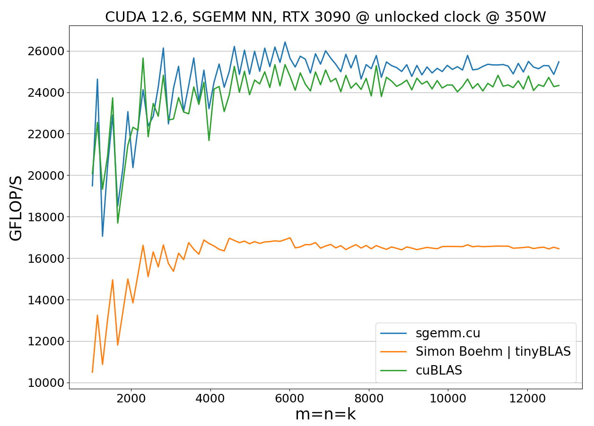
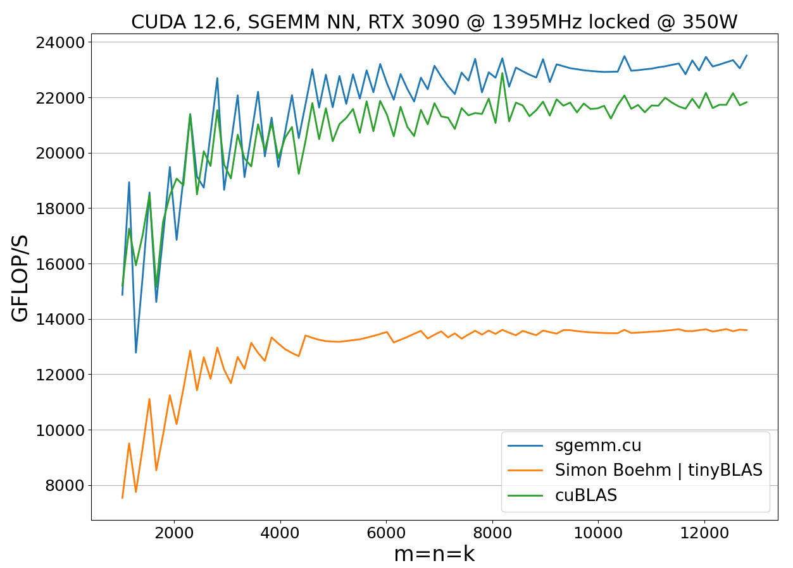

# High-Performance SGEMM on NVIDIA GPUs

> **Important note:** while the implementation is expected to be high-performant on all Ada/Ampere/Volta/Turing devices, it was specifically fine-tuned for and tested on NVIDIA RTX 3090 (GA102 chip - RTX 3080, A10, A40, A6000).

## Benchmark

>Avoid using WSL for performance measurements. To ensure accurate and reliable results, please use a native Linux environment.

To benchmark the code, specify compute capability of your CUDA device and run `benchmark.sh`. For example, on RTX 3090:

```bash
bash benchmark.sh 86
```

The benchmark settings such as minimum/maximum matrix sizes, step size, number of warm-up iterations etc. can be adjusted in the `benchmark.sh` file.

To visualize benchmark results, please install `matplotlib` and run

```bash
python plot_benchmark_data.py benchmark_results
```

## Tests

Use `test.sh` to test the implementation for correctness. For example, on RTX 3090:

```bash
bash test.sh 86
```

## Performance

Test environment:

- OS: Ubuntu 24.04.1 LTS
- GPU: NVIDIA RTX 3090
- CUDA 12.6, V12.6.85
- CMake 3.28.3
- g++ 13.3

<p align="center">
  
</p>

<p align="center">
  
</p>
